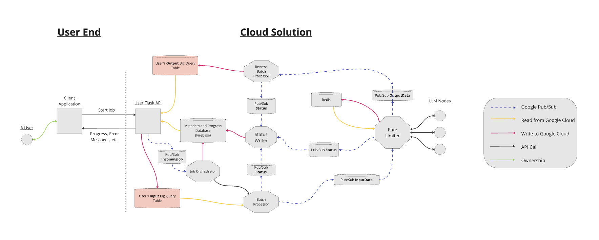

# Engineering Design Document
#### Authors
Bennett Taylor
Noah Robitshek
Sergio Rodriguez
Andrew Sasamori	
Rayan Syed
Yuhan Chen

***
## Context and Scope
The asynchronous batch processing solution for cloud LLMs is a project by a group of 6 students in Boston University's ENG EC 528 - Cloud Computing class in the fall of 2024. The project is in collaboration with Two Sigma, who provided the origional project idea/description and two mentors for the project. The purpose of the project is to develop a system which utilizes cloud computing to process large datasets using large language models. The team is required to complete the project over the course of 6 two-week sprints, with a demo given at the end of each sprint on the progress of the project. All research, documentation and development takes place over the course of these sprints.

***
## Goals and Non-Goals
#### Goals
- Orchestrate flow of requests to the LLM models
- Asynchronously process LLM requests contained within input datasets
- Ensure effiecient and fair dataset queuing from multiple users
- Minimizing the need for manual oversight
- Ensuring compliance with rate limits from LLM model providers
- Timely processing of large datasets
- Develop analytics and reporting tools to provide insights into system performance and usage patterns
- Notify users of important job information in real time
- Support multiple LLMs as options for dataset processing
- Return fully processed datasets to users

#### Non-Goals
- Be cost competitive with other LLM batch processors
- Handle many forms of dataset input and output
- Ensure specific metrics for latency, speed, cost or uptime
- Maximize the uptime of the system
- Perform automatic setup of the system

***
## System Design
#### Architecture Diagram

#### Cloud Platform
This cloud platform chosen to host this project is the Google Cloud Platform (GCP). The GCP provides a number of services that are valuable and fit the needs of the project. These include:
- **GC Run Containers** - An environment to run docker containers developed by the team
- **GC Pub/Sub** - A managed, asyncronous and distributed message system for use in transfering data between microservices within the cloud soltuion
- **GC Run Functions** - A highly scalable and efficient event-driven computation resource which is well integrated with  GC Pub/Sub, allowing for efficient processing of data in the system
- **GC BigQuery Tables** - For dataset input and output, a cloud resource which provides a standardized structure for how data will be given and returned within our system
- **GC Firestore** - A simple data store which can be easily accessed and managed on the cloud, for use in managing job metadata
- **IAM** - Allows for fine-grain access to cloud resources, improving security

The services listed above provide all the resources needed to complete the goals of this project at a reasonable cost and efficiency. The GCP is well documented and relatively easy to get started with and develop within for new cloud developers, which is important for this team.

An important factor in the choice of the GCP was the free $300 in credit for new users. This credit allows the team to quickly develop the cloud solution without having to secure funding from Two Sigma or Boston University, which would delay progress on the project greatly.

#### Dataset Input and Ouput
BigQuery tables were chosen due to

#### User-Facing API
The 

#### Internal Data Streaming

#### LLM Request Method

#### Error Handling

#### Degree of Constraints

***
## Alternatives Considered
#### Dataset Input and Ouput
**Google Cloud Data Buckets**

**File Upload**

**HTTP Requests**

**Web Sockets**

**gRPC**

#### User-Facing API
**Django**

**Google Cloud API Gateway**

#### Internal Data Streaming
**Kafka**

#### LLM Request Method
**Apache Flink**

***
## Cross-Cutting Concerns
#### Observability
#### Security
#### Privacy