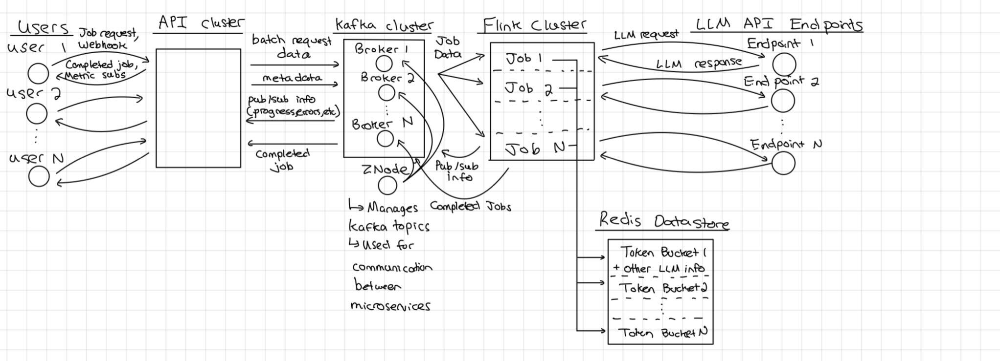

#    Project Title: Async Batch Processing Solution for Cloud-LLMs

## Team Members

| Names              | Roles   | Emails                |
| :----------------- | ------- | --------------------- |
| Yuhan Chen        | Student  | erv1n@bu.edu       |
| Noah Robitshek     | Student  | noahro@bu.edu      |
| Sergio Rodriguez      | Student  |  sergioer@bu.edu |
| Andrew Sasamori   | Student | sasamori@bu.edu        |
| Rayan Syed        | Student | rsyed@bu.edu         |
| Bennet Taylor     | Student | betaylor@bu.edu         |
| Stefan Philip | Mentor |        |
| Mayur Srivastava          | Mentor |       |

## Sprint Demos:
[Sprint1 Demo](https://drive.google.com/file/d/1AckVEbBgkP-q0t7MMwMPyFpk_JpBOWmr/view?usp=sharing)  
Sprint2 Demo   
Sprint3 Demo   
Sprint4 Demo   
Sprint5 Demo 

## Sprint Slideshows:
[Sprint1 Slideshow](https://docs.google.com/presentation/d/14M9Q9WwM2tktHl2NyspCqJEftkKHSECiHJnucQ3VKqw/edit?usp=sharing)  
Sprint2 Slideshow  
Sprint3 Slideshow  
Sprint4 Slideshow  
Sprint5 Slideshow  

## 1. The Problem

There are three large problems with the current process for calling LLMs available on the market. The first problem is Rate Limits which Cloud LLM providers impose. These limits prevent sending all requests simultaneously. Second is the problem of the Manual Oversight: required in the current process. The current manual process is inefficient and impractical for large-scale backfill jobs. The third problem is the inefficient management of requests caused a delayed timely output.

## 2.   Vision and Goals Of The Project:
The vision of this project is to create an automated, scalable, and efficient asynchronous batch processing solution for cloud-based Large Language Models (LLMs) at Two Sigma, enabling effortless data backfilling for large-scale financial datasets. By removing the complexity of rate limits imposed by cloud LLM providers and minimizing the need for manual oversight, this solution will allow for processing large amounts of data in an optimized and timely manner, ultimately improving operational capabilities.

High-Level Goals of this project include:
* Automating Rate-Limited Requests: Implement a queue system to manage the flow of LLM requests within the rate limits, making sure that millions of data points can be processed efficiently without intervention
* Optimize System Scalability and Efficiency: Architect the solution to handle large volumes of data and requests from multiple users, scaling dynamically while minimizing latency
* Improve User Experience: Develop a user-friendly interface for tracking the status of processing queues, monitoring system performance, and notifying users upon job completion
* Ensure Fault Tolerance: Design the system to gracefully handle failures, ensuring availability and reliability even under heavy workloads
* Cost Management: Optimize the use of cloud-based LLMs and other computational resources to minimize costs without sacrificing performance

## 3. Users/Personas Of The Project:

**Persona 1: Quantitative Researcher**

**Key Characteristics:** The quantitative researcher uses large datasets to develop investment strategies and conduct financial analysis, relying on cloud-based LLMs for data augmentation and processing. They face challenges due to rate limits imposed by providers, making manual management during backfill jobs impractical and time-consuming, which delays timely decision-making.

**Needs and Expectations:** They desire automated rate limit management to submit large-scale backfill jobs without manual intervention. Efficient asynchronous processing is needed to handle millions of data points concurrently, ensuring timely outputs. A user-friendly interface for job submission, progress monitoring, and notifications upon completion is preferred, allowing them to focus on data analysis rather than technical limitations.  

**Typical Scenario:** The researcher submits a backfill job involving millions of data points through the system without worrying about rate limits or monitoring. The system manages the request flow efficiently, automatically adhering to rate limits. Upon completion, they receive a notification and can immediately proceed with data analysis.

**Persona 2: Data Engineer**  

**Key Characteristics:**   
The data engineer manages data pipelines and infrastructure to support researchers and analysts. Skilled in system architecture, scalability, and performance optimization, they are familiar with cloud services and LLM integrations. Currently, they spend significant time manually managing rate limits and job queues for large backfill jobs, as existing systems struggle with increasing workloads.  

**Needs and Expectations:**
They require an automated, scalable solution capable of handling large data volumes and multiple concurrent user requests without manual oversight. Robustness and fault tolerance mechanisms are needed to handle failures gracefully and ensure high availability. Advanced monitoring tools and automated alerts for issues or job completions are desired. Insights into resource utilization to optimize costs associated with cloud LLM usage are also important.

**Typical Scenario:** The data engineer sets up parameters in the new system, which automatically manages request flows for multiple backfill jobs submitted by researchers. The system handles rate limiting, scales resources as needed, and provides real-time monitoring dashboards. If issues occur, they receive automated alerts and can address problems promptly without constant supervision.

## 4.   Scope and Features Of The Project:
**Scope Overview:**  

The scope of this project is to design and develop an asynchronous batch processing system that automates the management of rate limits and requests flows for cloud-based LLMs. The system will focus on ensuring efficient, scalable, and cost-effective processing of large datasets without requiring manual oversight. It will also provide a user-friendly interface for managing and monitoring the batch process.

The solution will integrate with various LLM providers (e.g., OpenAi, Google Vertex AI) and streamline the communications across different APIs, ensuring a united approach to input and output handling. The solution will also notify users upon job completion, while automating key functions such as queueing, rate limiting logic, and error handling. 

The scope of this project is to design and develop an asynchronous batch processing system that automates the management of rate limits and requests flows for cloud-based LLMs. The system will focus on ensuring efficient, scalable, and cost-effective processing of large datasets without requiring manual oversight. It will also provide a user-friendly interface for managing and monitoring the batch process.

The solution will integrate with various LLM providers (e.g., OpenAi, Google Vertex AI) and streamline the communications across different APIs, ensuring a united approach to input and output handling. The solution will also notify users upon job completion, while automating key functions such as queueing, rate limiting logic, and error handling. 

**In-Scope Features:** 
1. Async Batch Processing System:  
-  Develop an asynchronous system that handles and processes large datasets efficiently using cloud LLMs.
-  Enable the system to process tasks from multiple users and datasets at the same time.
- Ensure compliance with LLM rate limits through automated management of the flow of request.

2. Unified API Interface:
- Create a common interface to interact with multiple LLM providers regardless of different formats.
- Allow input via dataframes (e.g. pandas) and file formats (e.g. CSV, JSON).
Handle different output formats.

3. Queue, Scheduling and Rate Limit Management:
- Implement automated queue and rate limiting management using tools like Apache Kafka, - Redis, or custom rate limiting algorithms.
- Manage the flow of requests to the LLMs without requiring manual intervention, optimizing for speed and minimizing throttling.
- Evaluate in-memory queues vs. persistent queues for optimal performance in handling large data backfill jobs.

4. Scalability and Performance Optimization:
- Design the system to scale horizontally, accommodating increasing workloads without degrading performance.
- Optimize resource use in cloud environments for cost management.
Implement fault tolerance mechanisms.

5. Cost Optimization: 
- Evaluate cost factors and optimize the system to minimize expenses related to cloud LLM usage, storage, and data transfer. 
- Implement monitoring tools to track resource usage and costs over time.

**Stretch Features (Out-of-Scope for initial Phase):**
1. Dynamic Rate Limiting:
- Implement dynamic rate limit adjustment based on real-time feedback from LLM providers. This feature would allow the system to adjust its request flow according to available capacity, ensuring maximum efficiency.
2. Advanced Analytics and Reporting:
- Develop an analytics dashboard that provides insight into the system’s performance, including metrics on throughput, error rates, and usage patterns over time.
- Offer detailed reports to stakeholders, allowing them to optimize system use further.
3. User Interface and Automation:
- Build a user-friendly interface to track and monitor the status of request, including the number of queued, processed, and completed tasks.
- Automate notifications to users when the process is complete or when issues arise. 
4. Automated Error Handling:
- Develop a mechanism to automatically retry failed requests.
- Report error and log troubleshooting.
5. Notifications and Reporting:
- Automate notifications to users via email or other channels to inform when jobs are completed or errors occur.
- Develop reporting tools that provide insight into system performance, queue statuses, and LLM usage patterns.

This scope shows what  will be delivered in the project, focusing on asynchronous batch processing, scalability, and efficient rate limit management while avoiding unnecessary complexity and features in the initial development phases.

## 5. Solution Concept

**Stage 1: Information Ingestion**  
The start of the data pipeline will consist of collecting information from the users. Requests will likely be packaged with metadata and the data to be processed (pyarrow table, pandas data frame, etc.) as a binary. The request will then be sent to an HTTP endpoint exposed by our API hosted on google cloud. Multiple technologies could be used to manage our API including cloud endpoints, an API Gateway, or Apigee. Choices relating to specific implementation will be resolved as we continue to work on our design.

**Stage 2: Queuing Batch Process Requests**  
Once the API has received the batch request a google cloud function will push it to an incoming requests kafka topic. The microservice responsible for pushing the request to the kafka topic can also prepare the data for the Flink batch processing and rate limiting logic. In order to host Kafka and Flink clusters, we will need to set up a google kubernetes engine cluster and deploy using a service like Helm or Strimzi.

**Stage 3: Rate Limiting Logic**  
During this stage Flink will first ingest data from the kafka topic queue and prepare the batch to be processed by the LLM API. Before sending the request to the LLM API, logic relating to rate limit management will be performed and an LLM API node can be chosen. If needed the request can be requeued until a suitable node has been found.

**Stage 4: Forwarding Results**  
Once the Flink job has received a complete response from an LLM API it will add this data to an appropriate kafka queue. Depending on the initial request made to our API these queues could deliver the data back to the user via a number of different methods. The resultant data could be stored on the cloud and continued to be used from there or a pub/sub system could be implemented to notify clients that the batch job is complete and the resulting data can be collected.

## 6. Acceptance Criteria
Our minimum viable product will be labeled as:

**Minimum Criteria** 
1. Format the datasets into partitioned data and for it to work with pre-set listings of tested LLMs. This will likely be limited to the more ‘popular’ LLMs: OpenAI, Google, Azure. If the data follows the requirements to be processed by any of the requests, the other LLMs should be able to process it as well. For example, if the dataset can be parsed, partitioned, and is accepted to the Google LLM API, then our model should be able to reparse it into the appropriate requirements for Azure, OpenAI, etc.
2. The partitioned, batched data that is within the LLM API rate limits will get responses.
3. The data should be asynchronously batch processed; manual intervention is not required, data thrown into our model will be processed (and if not processed due to rate limits, labeled as such).
4. Model should work for any range of data, only limiting factors are cloud storage and rate limiting spendings. A high tier of LLM rate limits and large amounts of cloud storage should work in the same way as a low tier of LLM rate limits and low amounts of cloud storage. 
5. Multiple users will be able to contribute to the batch data across multiple systems

**Stretch goals:**
1. Friendly UI to understand how the data pipeline is being processed at any moment in time
2. Expand beyond OpenAI, Google, Azure and other LLMs for testing
3. Allowance for flexible data; PyArrow, Pandas, other libraries supporting other data/file types.

## 7. Rough Release Plan
**Sprint 1:** End to End Proof of Concept.    
During this demo, we will be building an end to end system that will mock the final data pipeline. This version will not use redis and will only implement a basic version of Apache Kafka and Flink those tasks are finished.

**Sprint 2:** Batch Queuing and Kafka Integration  
During this sprint, we will be integrating the batch processing, Kafka, and Flink technologies. 

**Sprint 3:** Rate Limiting Logic and Fault Tolerance. Implementing additional LLMs
During this sprint, we will begin to tune the rate limiting logic and include logic to detect and respond to Faults and Errors. Additionally, during this sprint we decide if we increase our offerings to more LLMs if possible.

**Sprint 4:** Forwarding Results and Notifications  
During this stage we will iterate on the response return process and handle notifications for the user.

**Sprint 5:** Scalability and Performance Optimization 
The final sprint will focus on scaling and tuning the pipeline to make sure it is efficient for Two Sigma’s use case as well as scaled large enough to withstand their jobs. 

