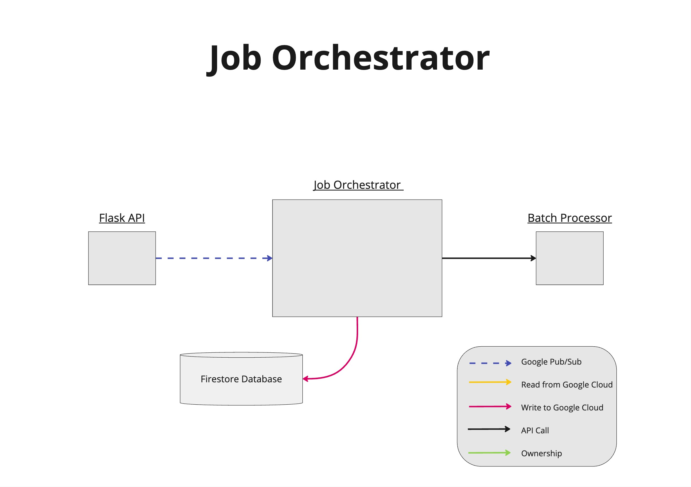

#    Project Title: Async Batch Processing Solution for Cloud-LLMs

## Team Members

| Names              | Roles   | Emails                |
| :----------------- | ------- | --------------------- |
| Yuhan Chen        | Student  | erv1n@bu.edu       |
| Noah Robitshek     | Student  | noahro@bu.edu      |
| Sergio Rodriguez      | Student  |  sergioer@bu.edu |
| Andrew Sasamori   | Student | sasamori@bu.edu        |
| Rayan Syed        | Student | rsyed@bu.edu         |
| Bennet Taylor     | Student | betaylor@bu.edu         |
| Stefan Philip | Mentor |        |
| Mayur Srivastava          | Mentor |       |

## Sprint Demo Videos:
[Sprint1 Demo](https://drive.google.com/file/d/1AckVEbBgkP-q0t7MMwMPyFpk_JpBOWmr/view?usp=sharing)  
[Sprint2 Demo](https://drive.google.com/file/d/1NjymlgsvtWI8tLfMjFaLiHEr-3TgZ8N5/view?usp=sharing)  
[Sprint3 Demo](https://drive.google.com/file/d/16_lV_df1BlzsAY3tFrf_6CKKA9yntzWA/view?usp=sharing)  
[Sprint4 Demo](https://drive.google.com/file/d/1QWUBAF8ekrdv3lGSUJAmf5UFGnswtPHv/view?usp=sharing)  
[Sprint5 Demo](https://drive.google.com/file/d/1RQ4_SbEfUcaeZkxm-eQ1F-HGWp4ByRd0/view?usp=sharing)  
Final Presentation

## Sprint Demo Slideshows:
[Sprint1 Slideshow](https://docs.google.com/presentation/d/14M9Q9WwM2tktHl2NyspCqJEftkKHSECiHJnucQ3VKqw/edit?usp=sharing)  
[Sprint2 Slideshow](https://docs.google.com/presentation/d/1h4vzF_IGO_7xRFhTZ4Gz1gRdLEJGcvXHZI2-pYbjRF4/edit?usp=sharing)   
[Sprint3 Slideshow](https://docs.google.com/presentation/d/1f_77tuTC3z717qgW_xtFdsB0G6VBBOTUwqp2TKolrZM/edit?usp=sharing)  
[Sprint4 Slideshow](https://docs.google.com/presentation/d/1LCoCL9HCC0GMx4awD1OfVJdlpK0LxsRrhhtyRrBAN9M/edit?usp=sharing)  
[Sprint5 Slideshow](https://docs.google.com/presentation/d/1nKVr_AxejMW-zizcu4_F4WmSpvvAdPP4nAIwX2-5RAw/edit?usp=sharing)  
Final Presentation Slideshow

## 1. The Problem

There are three large problems with the current process for calling LLMs available on the market. The first problem is Rate Limits which Cloud LLM providers impose. These limits prevent sending all requests simultaneously. Second is the problem of the Manual Oversight: required in the current process. The current manual process is inefficient and impractical for large-scale backfill jobs. The third problem is the inefficient management of requests caused a delayed timely output.

## 2.   Vision and Goals Of The Project:
The vision of this project is to create an automated, scalable, and efficient asynchronous batch processing solution for cloud-based Large Language Models (LLMs) at Two Sigma, enabling effortless data backfilling for large-scale financial datasets. By removing the complexity of rate limits imposed by cloud LLM providers and minimizing the need for manual oversight, this solution will allow for processing large amounts of data in an optimized and timely manner, ultimately improving operational capabilities.

High-Level Goals of this project include:
* Automating Rate-Limited Requests: Implement a queue system to manage the flow of LLM requests within the rate limits, making sure that millions of data points can be processed efficiently without intervention
* Optimize System Scalability and Efficiency: Architect the solution to handle large volumes of data and requests from multiple users, scaling dynamically while minimizing latency
* Improve User Experience: Develop a user-friendly interface for tracking the status of processing queues, monitoring system performance, and notifying users upon job completion
* Ensure Fault Tolerance: Design the system to gracefully handle failures, ensuring availability and reliability even under heavy workloads
* Cost Management: Optimize the use of cloud-based LLMs and other computational resources to minimize costs without sacrificing performance

## 3. Users/Personas Of The Project:

**Persona 1: Quantitative Researcher**

**Key Characteristics:** The quantitative researcher uses large datasets to develop investment strategies and conduct financial analysis, relying on cloud-based LLMs for data augmentation and processing. They face challenges due to rate limits imposed by providers, making manual management during backfill jobs impractical and time-consuming, which delays timely decision-making.

**Needs and Expectations:** They desire automated rate limit management to submit large-scale backfill jobs without manual intervention. Efficient asynchronous processing is needed to handle millions of data points concurrently, ensuring timely outputs. A user-friendly interface for job submission, progress monitoring, and notifications upon completion is preferred, allowing them to focus on data analysis rather than technical limitations.  

**Typical Scenario:** The researcher submits a backfill job involving millions of data points through the system without worrying about rate limits or monitoring. The system manages the request flow efficiently, automatically adhering to rate limits. Upon completion, they receive a notification and can immediately proceed with data analysis.

**Persona 2: Data Engineer**  

**Key Characteristics:**   
The data engineer manages data pipelines and infrastructure to support researchers and analysts. Skilled in system architecture, scalability, and performance optimization, they are familiar with cloud services and LLM integrations. Currently, they spend significant time manually managing rate limits and job queues for large backfill jobs, as existing systems struggle with increasing workloads.  

**Needs and Expectations:**
They require an automated, scalable solution capable of handling large data volumes and multiple concurrent user requests without manual oversight. Robustness and fault tolerance mechanisms are needed to handle failures gracefully and ensure high availability. Advanced monitoring tools and automated alerts for issues or job completions are desired. Insights into resource utilization to optimize costs associated with cloud LLM usage are also important.

**Typical Scenario:** The data engineer sets up parameters in the new system, which automatically manages request flows for multiple backfill jobs submitted by researchers. The system handles rate limiting, scales resources as needed, and provides real-time monitoring dashboards. If issues occur, they receive automated alerts and can address problems promptly without constant supervision.

## 4.   Scope and Features Of The Project:
**Scope Overview:**  

The scope of this project is to design and develop an asynchronous batch processing system that automates the management of rate limits and requests flows for cloud-based LLMs. The system will focus on ensuring efficient, scalable, and cost-effective processing of large datasets without requiring manual oversight. It will also provide a user-friendly interface for managing and monitoring the batch process along with an operator dashboard for operators to easily get insights on the system as a whole.

The solution will integrate with LLM providers (e.g. OpenAI) and streamline the communications across different APIs, ensuring a united approach to input and output BigQuery tables. The solution will provide users ways to check on job status, while automating key functions such as batch processing the input table, rate limiting the input prompts and data, and handling errors throughout the pipeline.

**In-Scope Features:** 
1. Async Batch Processing System:  
- Develop an asynchronous system that handles and processes large datasets efficiently through batching for cloud LLMs
- Enable the system to process tasks from multiple users and datasets at the same time
- Utilize Google PubSub for communication between all microservices within this system

2. Unified API Interface:
- Create a common interface between the backend and client-side for abstraction away from users and operators
- Allow job orchestrator to communicate with API to trigger the starting of the pipeline when needed
- Allow input via dataframes uploaded to BigQuery tables

3. Rate Limit Management:
- Implement automated handling of requests for LLMs through robust rate limiter keeping track of both requests and token usages with in-house tokenizer and rate-limiting algorithms with Redis for state
- Manage the flow of requests to the LLMs without requiring manual intervention, optimizing for speed and minimizing throttling
- Evaluate in-memory queues vs. persistent queues for optimal performance in handling large data backfill jobs

4. Scalability, Performance, and Cost Optimization:
- Design the system to scale horizontally, accommodating increasing workloads without degrading performance through the use of many serverless Google Cloud Functions
- Optimize resource use in cloud environments for cost management
- Implement monitoring tools to track resource usage and costs over time

**Stretch Features (Out-of-Scope for initial Phase):**
1. User Interface and Automation:
- Build a user-friendly interface in Jupyter Notebook to track and monitor the status of request, including the number of queued, processed, and completed tasks
- Present notifications to users when the process is complete or when issues arise

2. Advanced Analytics and Reporting
- Develop an analytics dashboard in Jupyter Notebook to provide insights into the system’s performance
- Capture and calculate key metrics such as LLM cost and throughput for operators to view overall performance and costs through the use of status writer and stats collector modules

This scope shows what was delivered in the project, focusing on asynchronous batch processing, scalability, and efficient rate limit management while avoiding unnecessary complexity and features in the initial development phases. However, the stretch quality-of-life features were also met successfully, providing users and operators an end-to-end robust pipeline with simple usability.

## 5. Solution Concept

**Stage 1: User Interface/Operator Dashboards**  
The User Interface provides a clean interface for Users to set up their input/output BigQuery tables, upload their dataframes, and start their jobs with ease.
The Operator Dashboard provides operators an interface to monitor performance and retrieve core time and cost metrics regarding specific jobs and the pipeline as a whole. 
All metadata for both of the user personas’ dashboards are stored in the Firestore database throughout job execution and accessed through the Flask API as described in the subsequent sections.

**Stage 2: Information Digestion**  

The start of the data pipeline will consist of collecting information from the users. Requests are packaged with metadata to be written into Firestore Database by the Job Orchestrator. The user’s data is uploaded as a BigQuery table which the system’s service account has access to. The request will then be sent to an HTTP endpoint exposed by our API hosted on google cloud. The API will then trigger the Job Orchestrator via the IncomingJob Pub/Sub topic, effectively starting the pipeline. 

**Stage 3: Batch Processing** 

The Job Orchestrator will start the Batch Processor via an HTTP request containing relevant data for a user’s job. The Batch Processor will read from the input table in the user’s project in batches of 100, subsequently forwarding individual rows to the Rate Limiter via the InputData Pub/Sub Topic. Additionally, all important error information and time metrics are communicated to the Firestore database through Pub/Sub communication with the Status Writer and Stats Collector modules. 

**Stage 4: Rate Limiting** 

The Rate Limiter accepts input prompts and corresponding relevant text and uses an in-house tokenizer algorithm to predict the amount of tokens it will need. The prediction is used to dynamically allocate a user bucket for a specific client and subsequently attempt to retrieve tokens from a global bucket (depending on the model requested). Once tokens have been allocated the request passes through a request limiter (also depending on the model requested) before finally calling the LLM API and sending the response to the Reverse Batch Processor via the Pub/Sub OutputData Topic. Should a rate limit occur through the LLM API call, internal exponential backoff algorithms are performed. All token bucket and request limiting metadata is stored in Redis. Additionally, all important progress and error information along with relevant metrics are communicated to the Firestore database through Pub/Sub communication with the Status Writer and Stats Collector modules. 

**Stage 5: Reverse Batch Processor**

The Reverse Batch Processor receives responses from the Rate Limiter and immediately writes them into the user’s project’s output BigQuery table for easy exporting as needed. Additionally, all important error information and time metrics are communicated to the Firestore database through Pub/Sub communication with the Status Writer and Stats Collector modules. 

## 6. Acceptance Criteria
Our minimum viable product will be labeled as:

**Minimum Criteria** 
1. Format the datasets into partitioned data and for it to work with pre-set listings of tested LLMs. This will likely be limited to the more ‘popular’ LLMs: OpenAI, Google, Azure. If the data follows the requirements to be processed by any of the requests, the other LLMs should be able to process it as well. For example, if the dataset can be parsed, partitioned, and is accepted to the Google LLM API, then our model should be able to reparse it into the appropriate requirements for Azure, OpenAI, etc.
2. The partitioned, batched data that is within the LLM API rate limits will get responses.
3. The data should be asynchronously batch processed; manual intervention is not required, data thrown into our model will be processed (and if not processed due to rate limits, labeled as such).
4. Model should work for any range of data, only limiting factors are cloud storage and rate limiting spendings. A high tier of LLM rate limits and large amounts of cloud storage should work in the same way as a low tier of LLM rate limits and low amounts of cloud storage. 
5. Multiple users will be able to contribute to the batch data across multiple systems

**Stretch goals:**
1. Friendly UI to understand how the data pipeline is being processed at any moment in time
2. Expand beyond OpenAI, Google, Azure and other LLMs for testing
3. Allowance for flexible data; PyArrow, Pandas, other libraries supporting other data/file types.

## 7. Rough Release Plan
**Sprint 1:** End to End Proof of Concept.    
During this demo, we will be building an end to end system that will mock the final data pipeline. This version will not use redis and will only implement a basic version of Apache Kafka and Flink those tasks are finished.

**Sprint 2:** Batch Queuing and Kafka Integration  
During this sprint, we will be integrating the batch processing, Kafka, and Flink technologies. 

**Sprint 3:** Rate Limiting Logic and Fault Tolerance. Implementing additional LLMs
During this sprint, we will begin to tune the rate limiting logic and include logic to detect and respond to Faults and Errors. Additionally, during this sprint we decide if we increase our offerings to more LLMs if possible.

**Sprint 4:** Forwarding Results and Notifications  
During this stage we will iterate on the response return process and handle notifications for the user.

**Sprint 5:** Scalability and Performance Optimization 
The final sprint will focus on scaling and tuning the pipeline to make sure it is efficient for Two Sigma’s use case as well as scaled large enough to withstand their jobs. 

